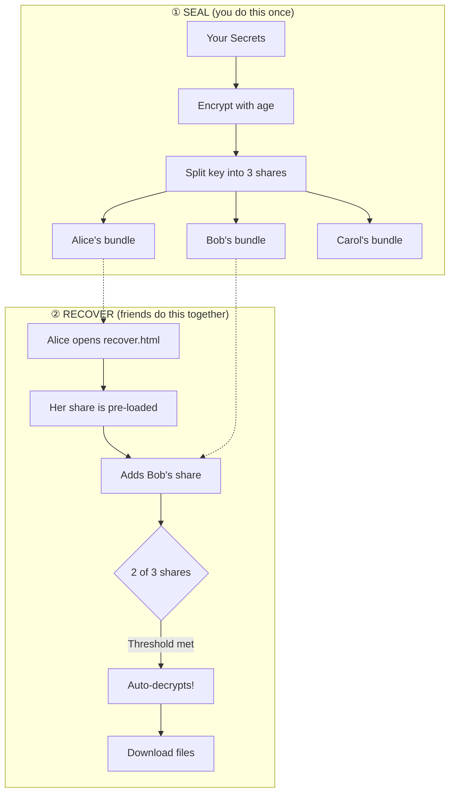

# 🧠 ReMemory

**Split your secrets among trusted friends. Recover them together when needed.**

ReMemory encrypts your files, splits the decryption key among friends using Shamir's Secret Sharing, and gives them a self-contained offline tool to reconstruct it together.

## The Key Innovation

**Recovery works in any browser, fully offline, without ReMemory or the internet.**

Each friend receives a bundle containing `recover.html`—a self-contained recovery tool. No servers. No dependencies. No need for this project to exist in 20 years.

**[Download demo bundles](https://github.com/eljojo/rememory/releases/latest/download/demo-bundles.zip)** to try the recovery process yourself — it's the best way to understand how ReMemory works.



The key insight: **any 2 shares can reconstruct the key, but a single share reveals nothing**—not "very little," mathematically zero information.

Both the number of friends and the threshold are fully configurable: 2-of-3 for a small circle, 3-of-5 for a wider group, or even 2-of-2 for couples with shared private content that neither partner can access alone.

---

## Two Ways to Use ReMemory

### 🌐 Web UI (Recommended)

Create bundles entirely in your browser — no installation required.

| | |
|---|---|
| **Create Bundles** | [eljojo.github.io/rememory/maker.html](https://eljojo.github.io/rememory/maker.html) |
| **Documentation** | [eljojo.github.io/rememory/docs.html](https://eljojo.github.io/rememory/docs.html) |

Everything runs locally in your browser. Your files never leave your device.

### 💻 CLI (Power Users)

For automation, scripting, or if you prefer the command line.

```bash
# Install
go install github.com/eljojo/rememory/cmd/rememory@latest

# Or download from GitHub Releases
```

See the **[CLI User Guide](docs/guide.md)** for complete documentation.

---

## Try It First

Before protecting real secrets, **try the recovery process** to understand how it works:

1. **[Download demo bundles](https://github.com/eljojo/rememory/releases/download/v0.0.3/demo-bundles.zip)** (contains 3 sample bundles)
2. Open `bundle-alice/recover.html` in your browser
3. Alice's share is pre-loaded — add Bob's share (or Carol's)
4. Watch the automatic decryption when the threshold is met

This hands-on experience will help you understand what your friends will see during a real recovery.

---

## What Friends Receive

Each friend gets a ZIP bundle containing:

| File | Purpose |
|------|---------|
| `README.txt` | Instructions + their unique share + contact list |
| `README.pdf` | Same content, formatted for printing |
| `MANIFEST.age` | Your encrypted secrets |
| `recover.html` | Browser-based recovery tool (~1.8 MB, self-contained) |

**A single share reveals absolutely nothing.** But tell your friends to keep their bundle safe—it's their responsibility to you.

---

## FAQ

<details>
<summary>Why ReMemory?</summary>

We all have digital secrets that matter: password manager recovery codes, cryptocurrency seeds, important documents, or instructions for loved ones. What happens to these if you're suddenly unavailable?

Traditional approaches fail:
- **Give one person everything** → Single point of failure and trust
- **Split files manually** → Confusing, error-prone, no encryption
- **Use a password manager's emergency access** → Relies on company existing
- **Write it in a will** → Becomes public record, slow legal process

ReMemory solves this with cryptographic guarantees:
- **No single point of failure** — Requires multiple friends to cooperate
- **No trust in any one person** — Even your most trusted friend can't access secrets alone
- **Offline and self-contained** — Recovery works without internet or servers
- **Designed for non-technical friends** — Clear instructions, not cryptographic puzzles

</details>

<details>
<summary>Why I Built This</summary>

Two things drove me to create ReMemory.

First, I watched [a documentary about Clive Wearing](https://www.youtube.com/watch?v=k_P7Y0-wgos), a man who has lived with a 7-second memory since 1985. Seeing how fragile memory can be made me think about what would happen to my digital life if something similar happened to me.

Second, I've had several concussions from cycling accidents. Each time, I've been lucky to recover fully. But each time, I've been reminded that our brains are more fragile than we like to think.

ReMemory is my answer: a way to ensure the people I trust can access what matters, even if I can't help them.

</details>

<details>
<summary>Threat Model</summary>

ReMemory assumes:
- Your friends will only cooperate when needed
- At least *threshold* friends will keep their bundle safe
- Your device is trusted when you create bundles
- The browser used for recovery is not compromised

ReMemory does NOT rely on:
- Any server or cloud service
- Any ReMemory website or infrastructure
- Any long-term availability of this project
- The internet during recovery

See the **[Security Audit](docs/security-audit.md)** for details.

</details>

<details>
<summary>Cryptographic Guarantees</summary>

| Component | Algorithm |
|-----------|-----------|
| Encryption | [age](https://github.com/FiloSottile/age) (scrypt passphrase mode) |
| Key derivation | scrypt (N=2²⁰, r=8, p=1) |
| Secret sharing | Shamir's Secret Sharing over GF(2⁸) |
| Integrity | SHA-256 checksums |
| Passphrase | 256 bits from crypto/rand |

**A single share reveals absolutely nothing about your secret.** This is a mathematical guarantee of Shamir's Secret Sharing—any fewer than *threshold* shares contains zero information about the original secret.

</details>

<details>
<summary>Failure Scenarios</summary>

| What if... | Result |
|------------|--------|
| A friend loses their bundle? | Fine, as long as threshold friends remain |
| A friend leaks their share publicly? | Harmless without threshold-1 other shares |
| ReMemory disappears in 10 years? | `recover.html` still works—it's self-contained |
| Browsers change dramatically? | Plain HTML + WASM with no external dependencies |
| You forget how this works? | Each bundle's README.txt explains everything |
| Some friends can't be reached? | That's why you set threshold below total friends |

</details>

<details>
<summary>Development</summary>

```bash
# Using Nix (recommended)
nix develop

# Build
make build

# Run tests
make test         # Unit tests
make test-e2e     # Browser tests (requires: npm install)

# Preview website locally
make serve        # Serves at http://localhost:8000
```

</details>

<details>
<summary>Other Similar Tools</summary>

There's a flavour of secret sharing for everyone. ReMemory isn't the first tool to use Shamir's Secret Sharing, but it focuses on making recovery possible for **non-technical people** without installing anything. Here's how it compares:

#### Shamir's Secret Sharing tools

| Tool | Type | Input | Splitting Method | Output | Non-technical Recovery | Offline | Contact Details |
|------|------|-------|-----------------|--------|----------------------|---------|-----------------|
| **[eljojo/rememory](https://github.com/eljojo/rememory)** | CLI + Web | Files & folders | Shamir's SSS | ZIP bundles with PDF instructions, `recover.html`, encrypted archive | Yes — open HTML in browser | Yes | Yes — included in each bundle |
| **[jesseduffield/horcrux](https://github.com/jesseduffield/horcrux)** | CLI | Files | Shamir's SSS | Encrypted file fragments | No — requires CLI | Yes | No |
| **[jefdaj/horcrux](https://github.com/jefdaj/horcrux)** | CLI | Files (GPG) | Shamir's SSS (via `ssss`) | `.key` + `.sig` files, steganography in images/audio | No — requires CLI + GPG | Yes (TAILS recommended) | No |
| **[paritytech/banana_split](https://github.com/paritytech/banana_split)** | Web app | Text only | Shamir's SSS + NaCl | Printable QR codes | Partial — scan QR + type passphrase | Yes (self-contained HTML) | No |
| **[cyphar/paperback](https://github.com/cyphar/paperback)** | CLI | Files | Shamir's SSS in GF(2^32) | Printable PDFs with QR codes + text fallback | Partial — scan QR or type text | Yes | No |
| **[simonfrey/s4](https://github.com/simonfrey/s4)** ([site](https://simon-frey.com/s4/)) | Web GUI + Go lib | Text/bytes | Shamir's SSS + AES | Text shares | No — copy/paste shares | Yes (save HTML locally) | No |
| **[xkortex/passcrux](https://github.com/xkortex/passcrux)** | CLI | Text/passphrases | Shamir's SSS | Text shares (hex/base32/base64) | No — requires CLI | Yes | No |
| **[ssss](http://point-at-infinity.org/ssss/)** | CLI | Text (128 char max) | Shamir's SSS | Text shares | No — requires CLI | Yes | No |
| **[cedws/amnesia](https://github.com/cedws/amnesia)** | CLI | Text/data streams | Shamir's SSS + argon2id | JSON file (Q&A-based, single user) | No — requires CLI | Yes | No |
| **[henrysdev/Haystack](https://github.com/henrysdev/Haystack)** | CLI | Files | Shamir's SSS | Encrypted file fragments | No — requires CLI | Yes | No |

#### Other approaches

| Tool | Type | Input | Method | Output | Non-technical Recovery | Offline | Contact Details |
|------|------|-------|--------|--------|----------------------|---------|-----------------|
| **[msolomon/keybearer](https://github.com/msolomon/keybearer)** ([site](https://michael-solomon.net/keybearer)) | Web app | Files | Layered encryption | Encrypted file download | Partial — web UI for decryption | Yes (client-side JS) | No |
| **[RobinWeitzel/secret_sharer](https://github.com/RobinWeitzel/secret_sharer)** ([site](https://robinweitzel.de/secret_sharer/)) | Web app | Text only | Split-key AES-256 (fixed 2-of-2) | PDF with 2 QR codes + security code | Yes — scan QR codes | Yes (client-side) | No |
| **[Bitwarden Emergency Access](https://bitwarden.com/help/emergency-access/)** | Web service | Vault items + attachments | RSA key exchange (1-of-1) | Live vault access (no file output) | Yes — web UI | No (server required) | Via Bitwarden accounts |
| **[potatoqualitee/eol-dr](https://github.com/potatoqualitee/eol-dr)** | Guide/checklist | N/A | N/A (not a tool) | [Printable checklist](https://github.com/potatoqualitee/eol-dr/blob/main/checklist.md) covering accounts, finances, subscriptions, devices | N/A | Yes (print it) | Template fields |

**Key takeaways:**

- Most tools only handle **text or passphrases** — [eljojo/rememory](https://github.com/eljojo/rememory), both horcrux projects, [henrysdev/Haystack](https://github.com/henrysdev/Haystack), [cyphar/paperback](https://github.com/cyphar/paperback), and [msolomon/keybearer](https://github.com/msolomon/keybearer) are the few that handle actual files.
- Only [eljojo/rememory](https://github.com/eljojo/rememory) generates a **self-contained recovery tool** (`recover.html`) bundled with each share — no installation, no internet, no CLI needed.
- Only [eljojo/rememory](https://github.com/eljojo/rememory) includes **contact details** in each bundle so friends know how to reach each other during recovery.
- [paritytech/banana_split](https://github.com/paritytech/banana_split) and [cyphar/paperback](https://github.com/cyphar/paperback) output **QR codes** for printing, which is great for paper-based backups of short secrets.
- **Bitwarden Emergency Access** is fundamentally different — it delegates vault access to one trusted person (not M-of-N splitting) and requires an online service.
- [potatoqualitee/eol-dr](https://github.com/potatoqualitee/eol-dr) is not a tool but a valuable **end-of-life planning [checklist](https://github.com/potatoqualitee/eol-dr/blob/main/checklist.md)** covering accounts, finances, subscriptions, and devices — complementary to any tool here.
- [ssss](http://point-at-infinity.org/ssss/) is the classic Unix implementation but is limited to 128 ASCII characters and requires a terminal.

</details>

## License

Apache-2.0 — Copyright 2026 José Albornoz

## Credits

Built on:
- [age](https://github.com/FiloSottile/age) — Modern file encryption by Filippo Valsorda
- [HashiCorp Vault's Shamir implementation](https://github.com/hashicorp/vault) — Battle-tested secret sharing
- [Cobra](https://github.com/spf13/cobra) — CLI framework

The protocol was [originally designed in a Google Doc](https://docs.google.com/document/d/1B4_wIN3fXqb67Tln0v5v2pMRFf8v5umkKikaqCRAdyM/edit?usp=sharing) in 2023.
