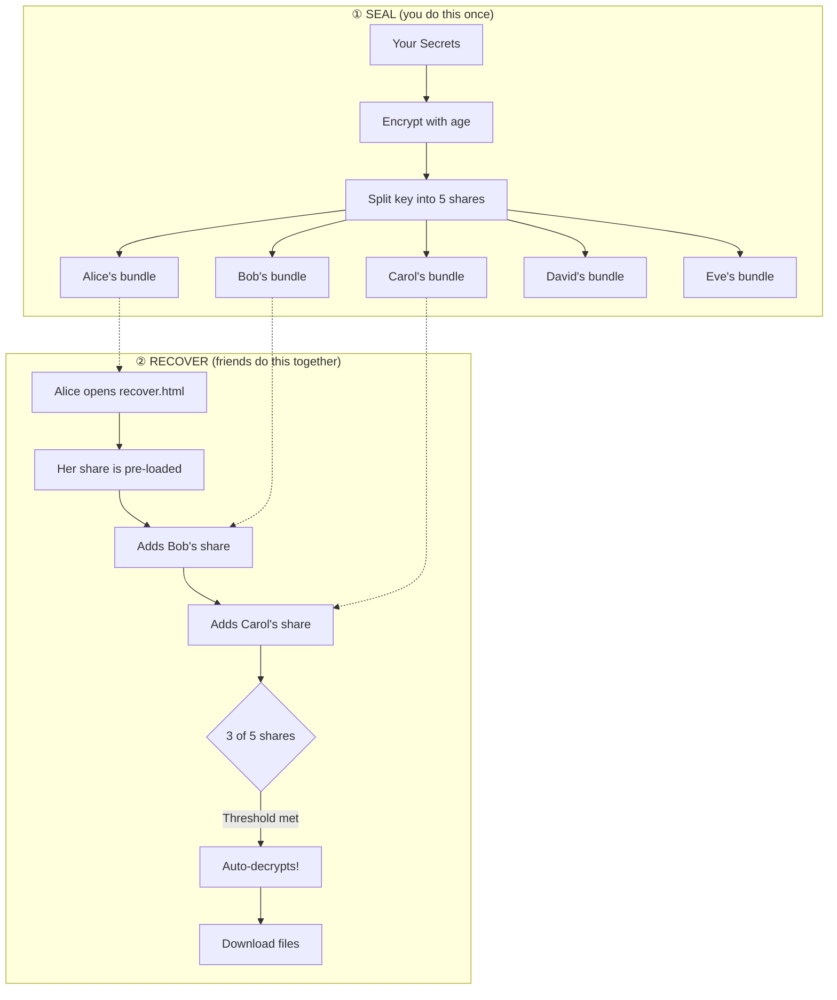

# 🧠 ReMemory

**Split your secrets among trusted friends. Recover them together when needed.**

ReMemory encrypts your files, splits the decryption key among friends using Shamir's Secret Sharing, and gives them a self-contained offline tool to reconstruct it together.

## The Key Innovation

**Recovery works in any browser, fully offline, without ReMemory or the internet.**

Each friend receives a bundle containing `recover.html`—a self-contained recovery tool. No servers. No dependencies. No need for this project to exist in 20 years.

**[Download demo bundles](https://github.com/eljojo/rememory/releases/latest/download/demo-bundles.zip)** to try the recovery process yourself — it's the best way to understand how ReMemory works.



The key insight: **any 3 shares can reconstruct the key, but 2 shares reveal nothing**—not "very little," mathematically zero information.

---

## Two Ways to Use ReMemory

### 🌐 Web UI (Recommended)

Create bundles entirely in your browser — no installation required.

| | |
|---|---|
| **Create Bundles** | [eljojo.github.io/rememory/maker.html](https://eljojo.github.io/rememory/maker.html) |
| **Documentation** | [eljojo.github.io/rememory/docs.html](https://eljojo.github.io/rememory/docs.html) |

Everything runs locally in your browser. Your files never leave your device.

### 💻 CLI (Power Users)

For automation, scripting, or if you prefer the command line.

```bash
# Install
go install github.com/eljojo/rememory/cmd/rememory@latest

# Or download from GitHub Releases
```

See the **[CLI User Guide](docs/guide.md)** for complete documentation.

---

## Try It First

Before protecting real secrets, **try the recovery process** to understand how it works:

1. **[Download demo bundles](https://github.com/eljojo/rememory/releases/download/v0.0.3/demo-bundles.zip)** (contains 3 sample bundles)
2. Open `bundle-alice/recover.html` in your browser
3. Alice's share is pre-loaded — add Bob's and Carol's shares
4. Watch the automatic decryption when threshold is met

This hands-on experience will help you understand what your friends will see during a real recovery.

---

## What Friends Receive

Each friend gets a ZIP bundle containing:

| File | Purpose |
|------|---------|
| `README.txt` | Instructions + their unique share + contact list |
| `README.pdf` | Same content, formatted for printing |
| `MANIFEST.age` | Your encrypted secrets |
| `recover.html` | Browser-based recovery tool (~1.8 MB, self-contained) |

**A single share reveals absolutely nothing.** But tell your friends to keep their bundle safe—it's their responsibility to you.

---

## FAQ

<details>
<summary>Why ReMemory?</summary>

We all have digital secrets that matter: password manager recovery codes, cryptocurrency seeds, important documents, or instructions for loved ones. What happens to these if you're suddenly unavailable?

Traditional approaches fail:
- **Give one person everything** → Single point of failure and trust
- **Split files manually** → Confusing, error-prone, no encryption
- **Use a password manager's emergency access** → Relies on company existing
- **Write it in a will** → Becomes public record, slow legal process

ReMemory solves this with cryptographic guarantees:
- **No single point of failure** — Requires multiple friends to cooperate
- **No trust in any one person** — Even your most trusted friend can't access secrets alone
- **Offline and self-contained** — Recovery works without internet or servers
- **Designed for non-technical friends** — Clear instructions, not cryptographic puzzles

</details>

<details>
<summary>Why I Built This</summary>

Two things drove me to create ReMemory.

First, I watched [a documentary about Clive Wearing](https://www.youtube.com/watch?v=k_P7Y0-wgos), a man who has lived with a 7-second memory since 1985. Seeing how fragile memory can be made me think about what would happen to my digital life if something similar happened to me.

Second, I've had several concussions from cycling accidents. Each time, I've been lucky to recover fully. But each time, I've been reminded that our brains are more fragile than we like to think.

ReMemory is my answer: a way to ensure the people I trust can access what matters, even if I can't help them.

</details>

<details>
<summary>Threat Model</summary>

ReMemory assumes:
- Your friends will only cooperate when needed
- At least *threshold* friends will keep their bundle safe
- Your device is trusted when you create bundles
- The browser used for recovery is not compromised

ReMemory does NOT rely on:
- Any server or cloud service
- Any ReMemory website or infrastructure
- Any long-term availability of this project
- The internet during recovery

See the **[Security Audit](docs/security-audit.md)** for details.

</details>

<details>
<summary>Cryptographic Guarantees</summary>

| Component | Algorithm |
|-----------|-----------|
| Encryption | [age](https://github.com/FiloSottile/age) (scrypt passphrase mode) |
| Key derivation | scrypt (N=2²⁰, r=8, p=1) |
| Secret sharing | Shamir's Secret Sharing over GF(2⁸) |
| Integrity | SHA-256 checksums |
| Passphrase | 256 bits from crypto/rand |

**A single share reveals absolutely nothing about your secret.** This is a mathematical guarantee of Shamir's Secret Sharing—any fewer than *threshold* shares contains zero information about the original secret.

</details>

<details>
<summary>Failure Scenarios</summary>

| What if... | Result |
|------------|--------|
| A friend loses their bundle? | Fine, as long as threshold friends remain |
| A friend leaks their share publicly? | Harmless without threshold-1 other shares |
| ReMemory disappears in 10 years? | `recover.html` still works—it's self-contained |
| Browsers change dramatically? | Plain HTML + WASM with no external dependencies |
| You forget how this works? | Each bundle's README.txt explains everything |
| Some friends can't be reached? | That's why you set threshold below total friends |

</details>

<details>
<summary>Development</summary>

```bash
# Using Nix (recommended)
nix develop

# Build
make build

# Run tests
make test         # Unit tests
make test-e2e     # Browser tests (requires: npm install)

# Preview website locally
make serve        # Serves at http://localhost:8000
```

</details>

<details>
<summary>Other Similar Tools</summary>

ReMemory isn't the first tool to use Shamir's Secret Sharing for file protection. I built ReMemory before discovering these alternatives:

- **[Horcrux](https://github.com/jesseduffield/horcrux)** — CLI tool that splits files into encrypted fragments using Shamir's Secret Sharing
- **[Haystack](https://github.com/henrysdev/Haystack)** — Elixir-based CLI for fragmenting confidential documents
- **[Horcrux (nao1215)](https://github.com/nao1215/horcrux)** — TypeScript library with adapters for Node.js and React Native (requires native runtime—uses Node.js crypto and streams directly)

**The key difference:** ReMemory is designed for non-technical people to perform the recovery.

With Horcrux or Haystack, your friends need to install software and run command-line tools to reconstruct your secrets. That's fine if your friends are developers, but most people's trusted circle includes family members, partners, or friends who've never opened a terminal.

ReMemory solves this by providing:
- **PDF instructions** — printable, readable, no technical knowledge required
- **ZIP bundles** — a familiar format anyone can open
- **Browser-based recovery** — just open `recover.html`, no installation needed
- **Self-contained offline tool** — works without internet, servers, or this project existing

The cryptographic foundation is the same. The difference is who can actually use it when you need them to.

</details>

## License

Apache-2.0 — Copyright 2026 José Albornoz

## Credits

Built on:
- [age](https://github.com/FiloSottile/age) — Modern file encryption by Filippo Valsorda
- [HashiCorp Vault's Shamir implementation](https://github.com/hashicorp/vault) — Battle-tested secret sharing
- [Cobra](https://github.com/spf13/cobra) — CLI framework

The protocol was [originally designed in a Google Doc](https://docs.google.com/document/d/1B4_wIN3fXqb67Tln0v5v2pMRFf8v5umkKikaqCRAdyM/edit?usp=sharing) in 2023.
