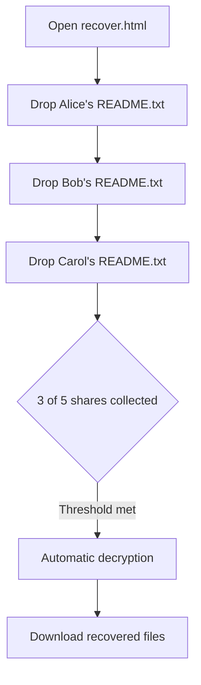
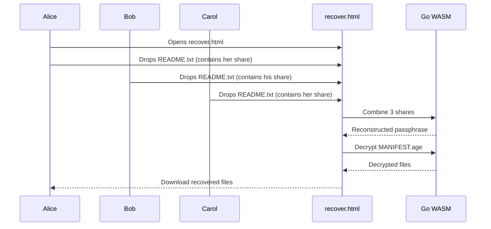
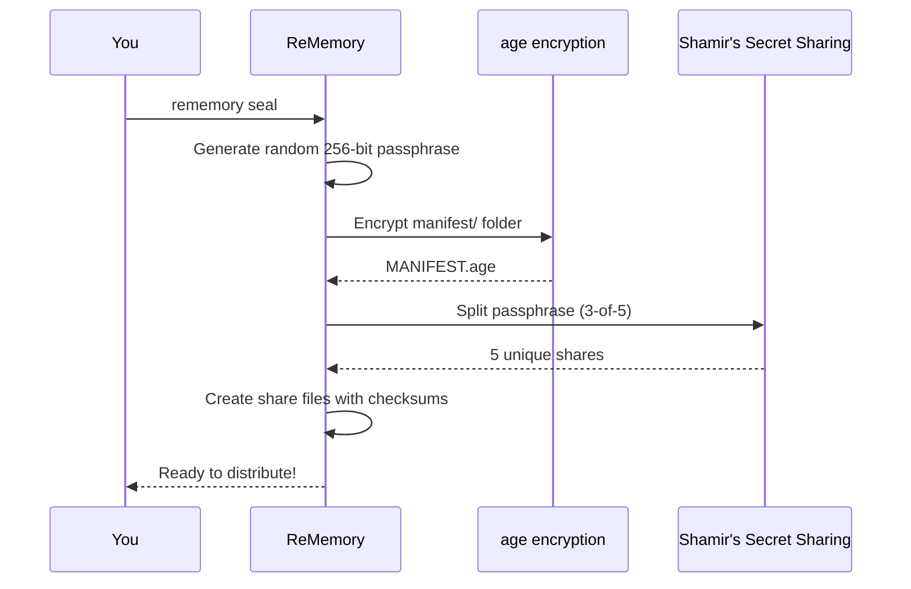
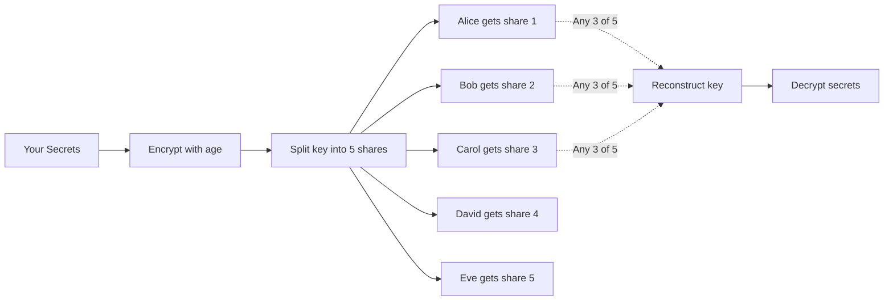

# 🧠 ReMemory

**A future-proof, human-recoverable, zero-infrastructure cryptographic inheritance protocol.**

ReMemory encrypts your files, splits the decryption key among friends, and gives them a self-contained offline tool to reconstruct it together when needed.

## The Key Innovation

**Recovery works in any browser, fully offline, without ReMemory or the internet.**

Each friend receives a bundle containing `recover.html`—a self-contained recovery tool that runs entirely in their browser. No servers. No dependencies. No need for this project to exist in 20 years.

Your friends can recover your secrets with nothing but a web browser and their bundles. That's it.

**[Download demo bundles](https://github.com/eljojo/rememory/releases/download/v0.0.2/demo-bundles.zip)** to try the recovery tool yourself. See the **[User Guide](docs/guide.md)** for a complete tutorial.



## Quick Start

See the **[User Guide](docs/guide.md)** for a complete tutorial.

### 1. Create a Project

```bash
rememory init my-recovery-2026
cd my-recovery-2026
```

You'll be prompted to enter your friends' names and contact information:

```
How many friends will hold shares? [5]: 5
How many shares needed to recover? [3]: 3

Friend 1:
  Name: Alice
  Email: alice@example.com
  Phone (optional): 555-1234

Friend 2:
  Name: Bob
  ...
```

### 2. Add Your Secrets

Place sensitive files in the `manifest/` directory:

```bash
cp ~/Documents/recovery-codes.txt manifest/
cp ~/Documents/crypto-seeds.txt manifest/
echo "The safe combination is 12-34-56" > manifest/notes.txt
```

### 3. Seal and Bundle

```bash
rememory seal
```

This encrypts your manifest, creates shares, and generates distribution bundles:

```
Archiving manifest/ (3 files, 1.2 KB)...
Encrypting with age...
Splitting into 5 shares (threshold: 3)...
Verifying reconstruction... OK

Sealed:
  ✓ output/MANIFEST.age
  ✓ output/shares/SHARE-alice.txt
  ✓ output/shares/SHARE-bob.txt
  ✓ output/shares/SHARE-carol.txt
  ✓ output/shares/SHARE-david.txt
  ✓ output/shares/SHARE-eve.txt

Generating bundles for 5 friends...

Bundles ready to distribute:
  ✓ bundle-alice.zip (5.4 MB)
  ✓ bundle-bob.zip (5.4 MB)
  ✓ bundle-carol.zip (5.4 MB)
  ✓ bundle-david.zip (5.4 MB)
  ✓ bundle-eve.zip (5.4 MB)

Saved to: output/bundles
```

### 4. Distribute to Friends

Send each friend their bundle. Each bundle contains:

| File | Purpose |
|------|---------|
| `README.txt` | Instructions + their share + contact list |
| `README.pdf` | Same content, formatted for printing |
| `MANIFEST.age` | Your encrypted secrets |
| `recover.html` | Browser-based recovery tool (~5 MB, self-contained) |

**A single share reveals absolutely nothing.** But tell your friends to keep their bundle safe anyway—it's their responsibility to you.

## How It Works

### What Your Friends Do (Recovery)

When the time comes, your friends gather and use `recover.html`:



Everything happens locally in the browser. No data leaves their computer.

### What You Do (Sealing)

When you run `rememory seal`:



### How Shamir's Secret Sharing Works



The key insight: any 3 shares can reconstruct the key, but 2 shares reveal nothing. Not "very little"—mathematically zero information.


<details>
<summary>Why ReMemory?</summary>

We all have digital secrets that matter: password manager recovery codes, cryptocurrency seeds, important documents, or instructions for loved ones. What happens to these if you're suddenly unavailable?

Traditional approaches fail:
- **Give one person everything** → Single point of failure and trust
- **Split files manually** → Confusing, error-prone, no encryption
- **Use a password manager's emergency access** → Relies on company existing
- **Write it in a will** → Becomes public record, slow legal process

ReMemory solves this with cryptographic guarantees:

- **No single point of failure** — Your secrets require multiple friends to cooperate
- **No trust in any one person** — Even your most trusted friend can't access secrets alone
- **Offline and self-contained** — Recovery works without internet, servers, or ReMemory itself
- **Designed for non-technical friends to succeed under stress** — Clear instructions, not cryptographic puzzles

</details>

<details>
<summary>Why I Built This</summary>

Two things drove me to create ReMemory.

First, I watched [a documentary about Clive Wearing](https://www.youtube.com/watch?v=k_P7Y0-wgos), a man who has lived with a 7-second memory since 1985. Seeing how fragile memory can be—how a single moment can permanently change everything—made me think about what would happen to my digital life if something similar happened to me.

Second, I've had several concussions from cycling accidents. Each time, I've been lucky to recover fully. But each time, I've also been reminded that our brains are more fragile than we like to think. What if the next accident is different?

ReMemory is my answer to these questions: a way to ensure the people I trust can access what matters, even if I can't help them.

</details>

<details>
<summary>What Friends Receive</summary>

Each friend's README.txt contains everything they need:

```
================================================================================
                          REMEMORY RECOVERY BUNDLE
                              For: Alice
================================================================================

!!  YOU CANNOT USE THIS FILE ALONE
    You will need help from other friends listed below.

!!  CONFIDENTIAL - DO NOT SHARE THIS FILE
    This document contains your secret share. Keep it safe.

    NOTA PARA HISPANOHABLANTES:
    Si no entiendes inglés, puedes usar ChatGPT u otra inteligencia artificial
    para que te ayude a entender estas instrucciones y recuperar los datos.

--------------------------------------------------------------------------------
WHAT IS THIS?
--------------------------------------------------------------------------------
This bundle allows you to help recover encrypted secrets.
You are one of 5 trusted friends who hold pieces of the recovery key.
At least 3 of you must cooperate to decrypt the contents.

--------------------------------------------------------------------------------
OTHER SHARE HOLDERS (contact to coordinate recovery)
--------------------------------------------------------------------------------
Bob - bob@example.com - 555-2345
Carol - carol@example.com
David - david@example.com - 555-4567
Eve - eve@example.com

--------------------------------------------------------------------------------
HOW TO RECOVER (PRIMARY METHOD - Browser)
--------------------------------------------------------------------------------
1. Open recover.html in any modern browser
2. Drag and drop this README.txt file
3. Collect shares from other friends (they drag their README.txt too)
4. Once you have enough shares, the tool will decrypt automatically
5. Download the recovered files

Works completely offline - no internet required!

--------------------------------------------------------------------------------
YOUR SHARE
--------------------------------------------------------------------------------
-----BEGIN REMEMORY SHARE-----
Version: 1
Index: 1
Total: 5
Threshold: 3
Holder: Alice
...
-----END REMEMORY SHARE-----
```

</details>

<details>
<summary>Recovery Methods</summary>

### Browser Recovery (Recommended)

1. Any friend opens `recover.html` from their bundle
2. Friends drag & drop their README.txt files
3. Once threshold is met, decryption happens automatically
4. Download the recovered files

No installation required. Works on any modern browser. Fully offline.

### CLI Recovery (Fallback)

If the browser tool doesn't work for some reason:

```bash
# Download rememory from GitHub releases
rememory recover \
  --shares alice-readme.txt,bob-readme.txt,carol-readme.txt \
  --manifest MANIFEST.age \
  --output recovered/
```

</details>

<details>
<summary>You store things in a Project</summary>

```
my-recovery-2026/
├── project.yml           # Configuration (friends, threshold)
├── manifest/             # Your secret files (ADD FILES HERE)
│   ├── README.md
│   └── ... your files ...
└── output/
    ├── MANIFEST.age      # Encrypted archive
    ├── shares/           # Individual share files
    │   ├── SHARE-alice.txt
    │   └── ...
    └── bundles/          # Distribution packages
        ├── bundle-alice.zip
        └── ...
```

</details>


<details>
<summary>Threat Model</summary>

ReMemory assumes:
- Your friends will only cooperate after you're gone (or when needed)
- At least *threshold* friends will keep their bundle safe
- Your computer is trusted at the time you run `seal`
- The browser used for recovery is not compromised at recovery time

ReMemory does NOT rely on:
- Any server or cloud service
- Any ReMemory website or infrastructure
- Any long-term availability of this project
- The internet during recovery

</details>

<details>
<summary>Cryptographic Guarantees</summary>

| Component | Algorithm |
|-----------|-----------|
| Encryption | [age](https://github.com/FiloSottile/age) (scrypt passphrase mode) |
| Key derivation | scrypt (N=2²⁰, r=8, p=1) |
| Secret sharing | Shamir's Secret Sharing over GF(2⁸) |
| Integrity | SHA-256 checksums |
| Passphrase | 256 bits from crypto/rand |

**A single share reveals absolutely nothing about your secret, even to a cryptography expert.** This is a mathematical guarantee of Shamir's Secret Sharing—any fewer than *threshold* shares contains zero information about the original secret.

</details>

<details>
<summary>Failure Scenarios</summary>

| What if... | Result |
|------------|--------|
| A friend loses their bundle? | Fine, as long as threshold friends remain |
| A friend leaks their share publicly? | Harmless without threshold-1 other shares |
| ReMemory disappears in 10 years? | `recover.html` still works—it's self-contained |
| Browsers change dramatically? | `recover.html` is plain HTML + WASM with no external dependencies |
| You forget how this works? | Each bundle's README.txt explains everything |
| Some friends can't be reached? | That's why you set threshold below total friends |

</details>

<details>
<summary>Development</summary>

```bash
make build        # Build binary
make test         # Run unit tests
make test-e2e     # Run browser tests (requires: npm install)
make build-all    # Cross-compile for all platforms
```

</details>

## License

MIT

## Credits

ReMemory implements a protocol built on:
- [age](https://github.com/FiloSottile/age) — Modern file encryption by Filippo Valsorda
- [HashiCorp Vault's Shamir implementation](https://github.com/hashicorp/vault) — Battle-tested secret sharing
- [Cobra](https://github.com/spf13/cobra) — CLI framework

The protocol was [originally designed in a Google Doc](https://docs.google.com/document/d/1B4_wIN3fXqb67Tln0v5v2pMRFf8v5umkKikaqCRAdyM/edit?usp=sharing) in 2023.
